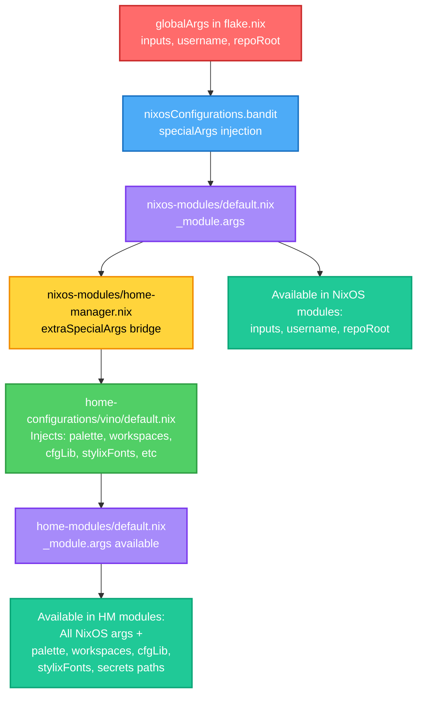

# Architecture Diagram

This document provides visual representations of the nixos-config repository architecture, showing how components are wired together.

## Mermaid Flowchart: Complete System Architecture

```mermaid
flowchart TB
    %% Entry Point Layer
    flake[flake.nix<br/>Entry Point]:::entry
    
    %% Framework Layer
    flakeParts[flake-parts.mkFlake]:::framework
    ezConfigs[ez-configs<br/>Auto-discovery]:::framework
    flakeModules[flake-modules/*<br/>cachix, deploy, devshell, etc]:::framework
    
    %% Discovery Layer
    nixosConfigs[nixos-configurations/<br/>bandit/]:::discovery
    homeConfigs[home-configurations/<br/>vino/]:::discovery
    
    %% Aggregator Layer
    nixosModules[nixos-modules/default.nix<br/>Main NixOS Aggregator]:::aggregator
    homeModules[home-modules/default.nix<br/>Main HM Aggregator]:::aggregator
    
    %% NixOS Module Categories
    nixosRoles[roles/*<br/>desktop, development, etc]:::module
    nixosCore[core/*<br/>boot, hardware, fonts, etc]:::module
    nixosSecurity[security/*<br/>sops, system, user]:::module
    nixosServices[services/*<br/>ssh, nix, virtualisation]:::module
    
    %% Home Manager Module Categories
    hmDesktop[desktop/*<br/>hyprland, kitty, rofi, etc]:::module
    hmEditor[editor/*<br/>helix, neovim]:::module
    hmShell[shell/*<br/>bash, starship, direnv]:::module
    hmTerminal[terminal/*<br/>tmux]:::module
    
    %% Cross-Cutting Concerns
    sharedModules[shared-modules/<br/>stylix-common.nix<br/>palette.nix]:::shared
    overlays[overlays/default.nix<br/>Custom Packages]:::shared
    secrets[.sops.yaml + secrets/*.yaml]:::shared
    
    %% Runtime Outputs
    nixosSystem[nixosConfigurations.bandit<br/>System Configuration]:::output
    homeManager[homeConfigurations.vino@bandit<br/>User Configuration]:::output
    runSecrets[/run/secrets<br/>System Secrets]:::output
    hmSecrets[~/.config/sops-nix<br/>User Secrets]:::output
    pkgsOverlay[pkgs with overlays<br/>Modified Package Set]:::output
    
    %% Main Flow
    flake --> flakeParts
    flake --> flakeModules
    flakeParts --> ezConfigs
    ezConfigs --> nixosConfigs
    ezConfigs --> homeConfigs
    
    %% NixOS Flow
    nixosConfigs --> nixosSystem
    nixosSystem --> nixosModules
    nixosModules --> nixosRoles
    nixosModules --> nixosCore
    nixosModules --> nixosSecurity
    nixosModules --> nixosServices
    
    %% Home Manager Flow
    homeConfigs --> homeManager
    homeManager --> homeModules
    homeModules --> hmDesktop
    homeModules --> hmEditor
    homeModules --> hmShell
    homeModules --> hmTerminal
    
    %% Cross-Cutting Imports
    nixosModules -.-> sharedModules
    homeModules -.-> sharedModules
    nixosModules --> overlays
    homeModules --> overlays
    
    %% Secrets Flow
    secrets --> nixosSecurity
    nixosSecurity --> runSecrets
    secrets --> hmShell
    hmShell --> hmSecrets
    
    %% Overlays Flow
    overlays --> pkgsOverlay
    pkgsOverlay -.-> nixosModules
    pkgsOverlay -.-> homeModules
    
    %% Styling
    classDef entry fill:#ff6b6b,stroke:#c92a2a,stroke-width:3px,color:#fff
    classDef framework fill:#4dabf7,stroke:#1971c2,stroke-width:2px,color:#fff
    classDef discovery fill:#51cf66,stroke:#2f9e44,stroke-width:2px,color:#fff
    classDef aggregator fill:#ffd43b,stroke:#f08c00,stroke-width:3px,color:#000
    classDef module fill:#a78bfa,stroke:#7c3aed,stroke-width:2px,color:#fff
    classDef shared fill:#ffa8a8,stroke:#e03131,stroke-width:2px,color:#000
    classDef output fill:#20c997,stroke:#0ca678,stroke-width:3px,color:#fff
```

## Mermaid Flowchart: _module.args Injection Flow



## ASCII Art Fallback

For terminals that don't support Mermaid rendering:

```
┌─────────────────────────────────────────────────────────────────────────┐
│                         NIXOS-CONFIG ARCHITECTURE                        │
└─────────────────────────────────────────────────────────────────────────┘

┌──────────────┐
│  flake.nix   │  Entry Point
│  (Entry)     │
└──────┬───────┘
       │
       ├────────────────┬──────────────────┬────────────────────┐
       ▼                ▼                  ▼                    ▼
┌──────────────┐  ┌──────────┐  ┌─────────────────┐  ┌────────────────┐
│ flake-parts  │  │ez-configs│  │  flake-modules  │  │   overlays/    │
│   .mkFlake   │  │   Auto   │  │  cachix, deploy │  │  default.nix   │
└──────┬───────┘  │ Discovery│  │  devshell, etc  │  └────────┬───────┘
       │          └────┬─────┘  └─────────────────┘           │
       │               │                                       │
       └───────────────┴────┬──────────────┐                  │
                            ▼              ▼                  │
                   ┌─────────────┐  ┌──────────────┐          │
                   │  nixos-     │  │    home-     │          │
                   │configura-   │  │configura-    │          │
                   │  tions/     │  │  tions/      │          │
                   │  bandit/    │  │   vino/      │          │
                   └──────┬──────┘  └──────┬───────┘          │
                          │                │                  │
                          ▼                ▼                  │
                   ┌─────────────┐  ┌──────────────┐          │
                   │   nixos-    │  │    home-     │          │
                   │  modules/   │  │  modules/    │          │
                   │ default.nix │  │ default.nix  │          │
                   │ (Aggregator)│  │ (Aggregator) │          │
                   └──────┬──────┘  └──────┬───────┘          │
                          │                │                  │
          ┌───────┬───────┼────────┐       │                  │
          ▼       ▼       ▼        ▼       │                  │
      ┌─────┐ ┌──────┐ ┌────┐ ┌─────┐     │                  │
      │roles│ │core  │ │sec.│ │svcs │     │                  │
      │ /*  │ │ /*   │ │/*  │ │ /*  │     │                  │
      └─────┘ └──────┘ └────┘ └─────┘     │                  │
                                           │                  │
                          ┌────────┬───────┴────────┬─────┐   │
                          ▼        ▼                ▼     ▼   │
                      ┌────────┐ ┌──────┐ ┌──────┐ ┌────┐   │
                      │desktop │ │editor│ │shell │ │term│   │
                      │  /*    │ │  /*  │ │  /*  │ │/*  │   │
                      └────────┘ └──────┘ └──────┘ └────┘   │
                                                             │
                  ┌──────────────────────────────────────────┘
                  │
                  ▼
          ┌───────────────┐
          │  pkgs with    │
          │  overlays     │
          └───────────────┘

Cross-Cutting:
  shared-modules/ ───┬──→ nixos-modules/
  (stylix, palette)  └──→ home-modules/

Secrets:
  .sops.yaml + secrets/*.yaml ──→ sops-nix ──┬──→ /run/secrets (system)
                                              └──→ ~/.config/sops-nix (HM)

_module.args Injection:
  flake.nix (globalArgs) ──→ nixosConfigurations.bandit (specialArgs)
                        ──→ nixos-modules/home-manager.nix (extraSpecialArgs)
                        ──→ home-configurations/vino/default.nix (custom args)
                        ──→ home-modules/* (available everywhere)
```

## Layer Boundaries

```
┏━━━━━━━━━━━━━━━━━━━━━━━━━━━━━━━━━━━━━━━━━━━━━━━━━━━━━━━━━━━━━━━━━━┓
┃ LAYER 1: ENTRY POINT                                              ┃
┃   • flake.nix - Single source of truth                            ┃
┃   • Defines globalArgs (_module.args namespace)                   ┃
┗━━━━━━━━━━━━━━━━━━━━━━━━━━━━━━━━━━━━━━━━━━━━━━━━━━━━━━━━━━━━━━━━━━┛
                                 ▼
┏━━━━━━━━━━━━━━━━━━━━━━━━━━━━━━━━━━━━━━━━━━━━━━━━━━━━━━━━━━━━━━━━━━┓
┃ LAYER 2: FRAMEWORK & ORCHESTRATION                                ┃
┃   • flake-parts.mkFlake - Flake composition                       ┃
┃   • ez-configs - Auto-discovery engine                            ┃
┃   • flake-modules/* - Build/deploy/dev tooling                    ┃
┗━━━━━━━━━━━━━━━━━━━━━━━━━━━━━━━━━━━━━━━━━━━━━━━━━━━━━━━━━━━━━━━━━━┛
                                 ▼
┏━━━━━━━━━━━━━━━━━━━━━━━━━━━━━━━━━━━━━━━━━━━━━━━━━━━━━━━━━━━━━━━━━━┓
┃ LAYER 3: DISCOVERY & OUTPUTS                                      ┃
┃   • nixos-configurations/bandit/ → nixosConfigurations.bandit     ┃
┃   • home-configurations/vino/ → homeConfigurations."vino@bandit"  ┃
┗━━━━━━━━━━━━━━━━━━━━━━━━━━━━━━━━━━━━━━━━━━━━━━━━━━━━━━━━━━━━━━━━━━┛
                                 ▼
┏━━━━━━━━━━━━━━━━━━━━━━━━━━━━━━━━━━━━━━━━━━━━━━━━━━━━━━━━━━━━━━━━━━┓
┃ LAYER 4: AGGREGATION                                              ┃
┃   • nixos-modules/default.nix - Main NixOS module aggregator      ┃
┃   • home-modules/default.nix - Main Home Manager aggregator       ┃
┃   • Both set _module.args and import category modules             ┃
┗━━━━━━━━━━━━━━━━━━━━━━━━━━━━━━━━━━━━━━━━━━━━━━━━━━━━━━━━━━━━━━━━━━┛
                                 ▼
┏━━━━━━━━━━━━━━━━━━━━━━━━━━━━━━━━━━━━━━━━━━━━━━━━━━━━━━━━━━━━━━━━━━┓
┃ LAYER 5: MODULE CATEGORIES                                        ┃
┃   NixOS Side:                  Home Manager Side:                 ┃
┃   • roles/* (desktop, dev)     • desktop/* (hyprland, rofi)       ┃
┃   • core/* (boot, hardware)    • editor/* (helix, neovim)         ┃
┃   • security/* (sops, user)    • shell/* (bash, starship)         ┃
┃   • services/* (ssh, nix)      • terminal/* (tmux)                ┃
┗━━━━━━━━━━━━━━━━━━━━━━━━━━━━━━━━━━━━━━━━━━━━━━━━━━━━━━━━━━━━━━━━━━┛
                                 ▼
┏━━━━━━━━━━━━━━━━━━━━━━━━━━━━━━━━━━━━━━━━━━━━━━━━━━━━━━━━━━━━━━━━━━┓
┃ CROSS-CUTTING CONCERNS (Available to Layers 4-5)                  ┃
┃   • shared-modules/stylix-common.nix - Theme coordination         ┃
┃   • shared-modules/palette.nix - Color definitions                ┃
┃   • overlays/default.nix - Package modifications                  ┃
┃   • .sops.yaml + secrets/*.yaml - Secret management               ┃
┗━━━━━━━━━━━━━━━━━━━━━━━━━━━━━━━━━━━━━━━━━━━━━━━━━━━━━━━━━━━━━━━━━━┛
```

## Legend

### Node Types

| Symbol/Color | Type | Description | Examples |
|--------------|------|-------------|----------|
| 🔴 Red | Entry Point | The single entry to the entire configuration | `flake.nix` |
| 🔵 Blue | Framework | External frameworks and composition tools | `flake-parts`, `ez-configs` |
| 🟢 Green | Discovery | Directory scanning and auto-discovery layers | `nixos-configurations/`, `home-configurations/` |
| 🟡 Yellow | Aggregator | Main module aggregation points with thick borders | `nixos-modules/default.nix`, `home-modules/default.nix` |
| 🟣 Purple | Module | Individual functional modules | `roles/desktop.nix`, `desktop/hyprland/` |
| 🔶 Orange | Shared/Cross-Cutting | Modules imported by both NixOS and HM | `shared-modules/*`, `overlays/` |
| 🟢 Teal | Output/Runtime | Final system outputs and runtime locations | `nixosConfigurations.bandit`, `/run/secrets` |

### Edge Types

| Symbol | Type | Description |
|--------|------|-------------|
| `──→` | Direct Import | Module directly imports another module |
| `──▶` | Generates/Produces | Component produces output configuration |
| `- - →` | Reference/Use | Component references or uses another (without direct import) |
| `··→` | Cross-Cutting | Shared concern that affects multiple layers |
| `══→` | Args Injection | `_module.args` or `specialArgs` flow |

### Key Concepts

#### Aggregators
**What:** Files that import and combine multiple modules into a cohesive system.
**Where:** `nixos-modules/default.nix`, `home-modules/default.nix`
**Why:** Provides single entry point for each subsystem, sets `_module.args`, enforces structure.

#### Cross-Cutting Concerns
**What:** Modules used by both NixOS and Home Manager configurations.
**Where:** `shared-modules/`, `overlays/`
**Why:** DRY principle - shared styling (Stylix), colors (palette), and packages (overlays).

#### _module.args Injection Points
**What:** Mechanism to pass arguments to all modules in a system.
**Flow:**
1. `flake.nix` defines `globalArgs` (inputs, username, repoRoot)
2. `nixosConfigurations.bandit` receives via `specialArgs`
3. `nixos-modules/default.nix` sets `_module.args` (available to all NixOS modules)
4. `nixos-modules/home-manager.nix` bridges via `extraSpecialArgs` to HM
5. `home-configurations/vino/default.nix` injects HM-specific args (palette, workspaces, cfgLib, etc)
6. `home-modules/default.nix` has all args available

#### Auto-Discovery (ez-configs)
**What:** Framework that scans directories to automatically generate configurations.
**How:** `ezConfigs.root = ./.` scans:
- `nixos-configurations/*/default.nix` → `nixosConfigurations.<name>`
- `home-configurations/*/default.nix` → `homeConfigurations."<name>@<hostname>"`
**Why:** Eliminates manual configuration registration in flake.nix.

#### Secrets Management Flow
**Source:** `.sops.yaml` (config) + `secrets/*.yaml` (encrypted files)
**NixOS Path:** sops-nix → `/run/secrets/*` (system-level secrets)
**HM Path:** sops-nix → `~/.config/sops-nix/*` (user-level secrets)
**Integration:** `nixos-modules/security/sops.nix` + `home-modules/shell/sops.nix`

#### Overlays
**What:** Modifications to the Nixpkgs package set.
**Where:** `overlays/default.nix`
**Provides:**
- `pkgs.stable` - Fallback to stable channel
- Custom packages (qbpm, bdfextract, etc)
**Applied:** Automatically via `nixpkgs.overlays` in both NixOS and HM contexts

## Understanding the Wiring

### How a NixOS Configuration Builds

1. **Entry:** `nix build .#nixosConfigurations.bandit.config.system.build.toplevel`
2. **Discovery:** ez-configs finds `nixos-configurations/bandit/default.nix`
3. **Aggregation:** Imports `nixos-modules/default.nix`
4. **Module Loading:** Aggregator imports roles, core, security, services
5. **Cross-Cutting:** Shared modules (Stylix, palette) imported
6. **Package Resolution:** Overlays applied to pkgs
7. **Secrets:** sops-nix decrypts secrets → `/run/secrets`
8. **Output:** Complete system closure ready for activation

### How a Home Manager Configuration Builds

1. **Entry:** `nix build .#homeConfigurations."vino@bandit".activationPackage`
2. **Discovery:** ez-configs finds `home-configurations/vino/default.nix`
3. **Bridge:** NixOS module `nixos-modules/home-manager.nix` passes specialArgs
4. **Args Injection:** `home-configurations/vino/default.nix` adds palette, workspaces, etc
5. **Aggregation:** Imports `home-modules/default.nix`
6. **Module Loading:** Aggregator imports desktop, editor, shell, terminal
7. **Cross-Cutting:** Shared modules (Stylix) imported
8. **Package Resolution:** Overlays applied to pkgs
9. **Secrets:** sops-nix user secrets → `~/.config/sops-nix`
10. **Output:** User environment activation package

### Critical Wiring Points

| Point | File | Purpose |
|-------|------|---------|
| Global Args Definition | `flake.nix` | Defines inputs, username, repoRoot for entire system |
| NixOS Args Injection | `nixos-modules/default.nix` | Sets `_module.args` for all NixOS modules |
| HM Bridge | `nixos-modules/home-manager.nix` | Passes NixOS args to HM via `extraSpecialArgs` |
| HM Args Injection | `home-configurations/vino/default.nix` | Adds HM-specific args (palette, workspaces, etc) |
| Shared Styling | `shared-modules/stylix-common.nix` | Single source for Stylix configuration |
| Color Definitions | `shared-modules/palette.nix` | Kanagawa color scheme for entire system |
| Package Modifications | `overlays/default.nix` | Custom packages and stable fallback |

## Navigation Tips

- **Start Here:** `flake.nix` - See all inputs and top-level structure
- **NixOS Entry:** `nixos-configurations/bandit/default.nix` - Hardware and system-specific config
- **NixOS Modules:** `nixos-modules/default.nix` - See all imported NixOS modules
- **HM Entry:** `home-configurations/vino/default.nix` - User-specific config and arg injection
- **HM Modules:** `home-modules/default.nix` - See all imported HM modules
- **Shared Config:** `shared-modules/` - Configuration shared across NixOS and HM
- **Secrets Config:** `.sops.yaml` - See which secrets exist and their permissions
- **Custom Packages:** `overlays/default.nix` - See custom and modified packages

## Related Documentation

- [Overview](overview.md) - High-level system understanding
- [Conventions](conventions.md) - Coding standards and patterns
- [User Guide](../user/quickstart.md) - Common operations
